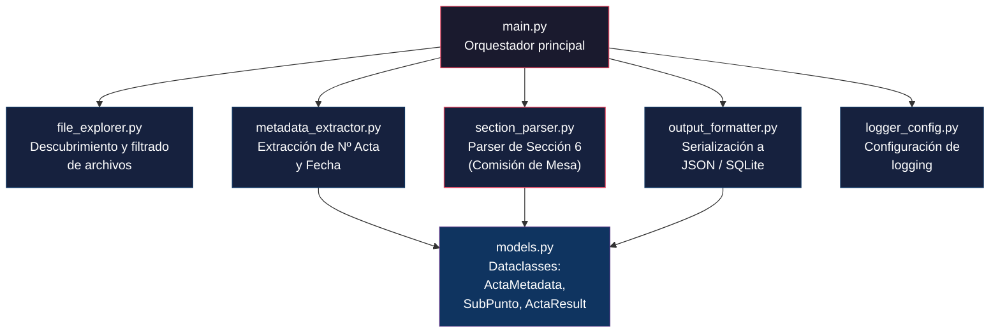
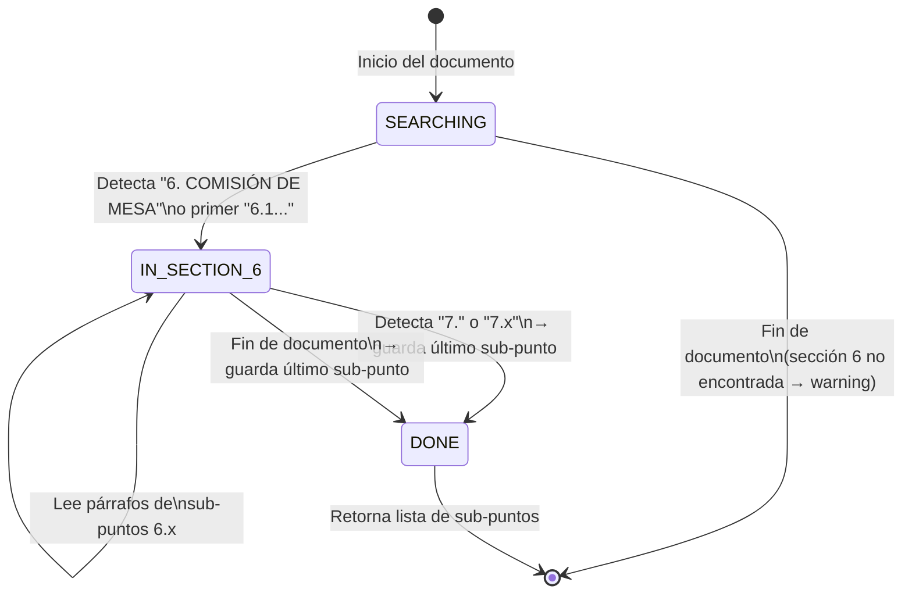
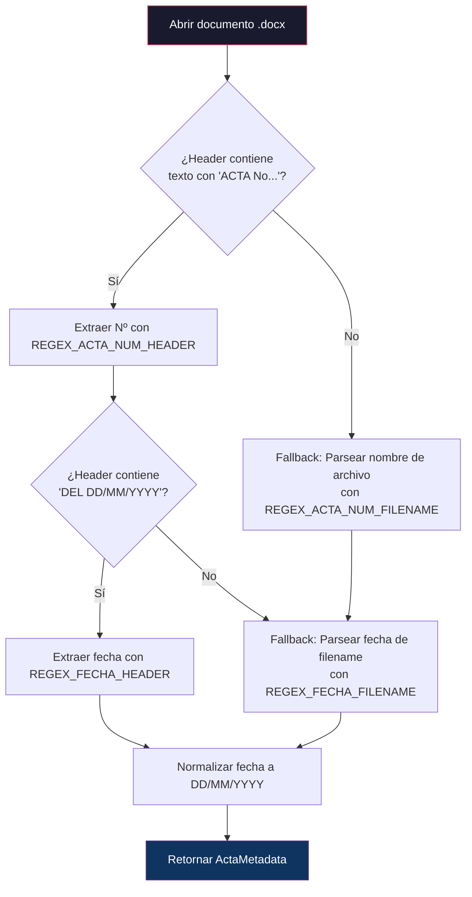
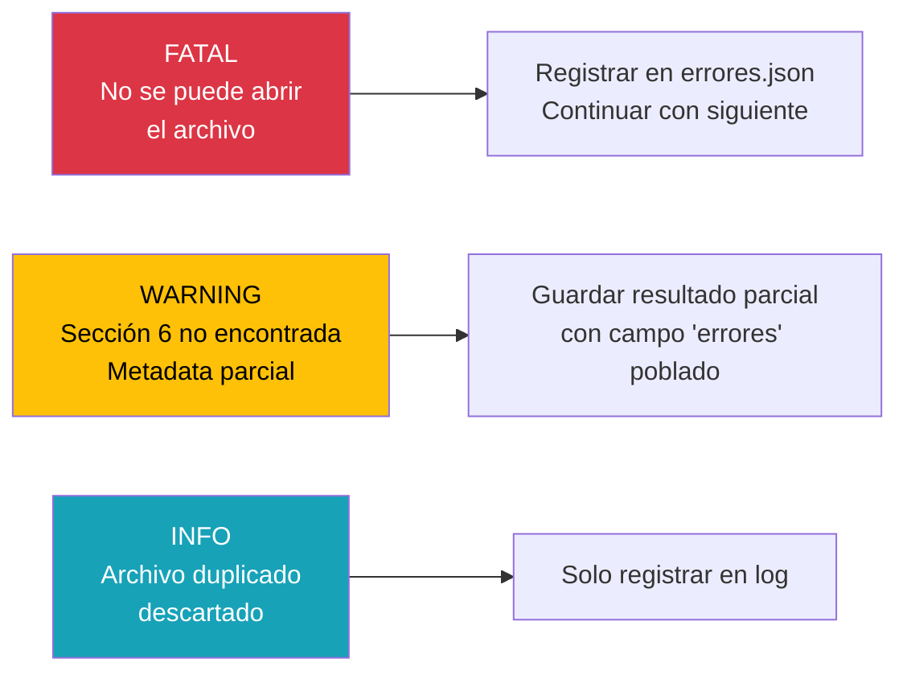

# Plan de Desarrollo Técnico — Pipeline ETL de Actas de Consejo

## Objetivo

Construir un pipeline ETL en Python que automatice la extracción de información histórica desde archivos `.docx` de actas de consejo de facultad, produciendo datos estructurados listos para alimentar un sistema de gestión administrativa (SIGMA).

---

## 1. Análisis de la Solución

### 1.1 Hallazgos del Análisis de los Datos Fuente

Se realizó un análisis exhaustivo del corpus de documentos reales en el workspace. Los hallazgos clave son:

| Aspecto | Hallazgo |
|---|---|
| **Volumen** | ~113 archivos `.docx` + ~31 archivos `.doc` (legacy) + archivos no-acta (asistencia, CCC, CEAP, PDF) |
| **Estructura de carpetas** | `CF 20XX/actas/*.docx` (confirmado para 2022, 2023, 2024) |
| **Carpeta adicional** | `Recursos/Actas nuevas/` contiene 8 actas de 2026 — **incluida en el procesamiento** |
| **Ubicación del Nº de Acta y Fecha** | **Varía por año**: En 2022-2023 está en el **header** del documento (`ACTA No 14`, `DEL 12/07/2022`). En 2024 el header está **vacío** y los datos solo están en el **nombre del archivo** |
| **Formato del header** | `FACES - CONSEJO DE FACULTAD… ACTA No. XX` + `DEL DD/MM/YYYY` (2 párrafos) |
| **Formato del filename** | `ACTA XX DEL DD-MM-YYYY.docx` (con variaciones: `DEF`, `rev.`, espacios dobles, `(1)`, etc.) |
| **Sección 6 - Introducción** | A veces aparece `6. COMISIÓN DE MESA` como párrafo explícito; a veces solo empieza directamente con `6.1.` |
| **Sección 6 - Contexto previo** | Antes de `6.1` suelen aparecer líneas como `COMISIÓN DE MESA`, nombre de oficina/escuela (`OFICINA DE ASESORÍA JURÍDICA`) |
| **Sub-puntos** | Formato `6.N.` o `6.N` (sin punto final), con N hasta ~51 en documentos largos |
| **Contenido entre sub-puntos** | Cada `6.x` puede contener: texto descriptivo, `Nota de la Comisión de Mesa:`, `Acuerdo:`, tablas, nombres de escuelas |
| **Fin de sección 6** | Delimitado por `7.` (típicamente `7. CASOS DIFERIDOS:` o `7.1.`) |
| **Archivos duplicados** | Múltiples copias con sufijos `(1)`, `(2)`, variantes `DEF`, `AR`, `D` |
| **Archivos no-acta** | `ASISTENCIA ACTA`, `CCC-ACTA`, `PERSONAL ACTA`, `CEAP - ACTA` — deben ser **filtrados** |

> [!NOTE]
> **Archivos `.doc` (formato legacy)**: Hay 31 archivos en formato `.doc` antiguo. Se implementará un **paso previo de conversión batch `.doc` → `.docx`** usando `LibreOffice` en modo headless (`soffice --headless --convert-to docx`). Los archivos convertidos se guardarán en una subcarpeta `converted/` sin alterar los originales.

> [!IMPORTANT]
> **Nombres de archivo inconsistentes**: Los nombres contienen variaciones significativas (espacios dobles `ACTA  17`, sufijos `DEF`, `AR`, `rev.`, copias numeradas `(1)`, `(2)`). El filtro de archivos debe ser robusto y evitar procesar duplicados.

### 1.2 Librerías Recomendadas

| Librería | Propósito | Justificación |
|---|---|---|
| `python-docx` | Lectura y parsing de archivos `.docx` | Estándar de facto para manipular `.docx` via Python. Acceso granular a párrafos, headers, estilos, tablas y XML subyacente |
| `re` (stdlib) | Expresiones regulares | Indispensable para detectar patrones de numeración (`6.1.`, `7.`), extraer números de acta y fechas |
| `pathlib` (stdlib) | Exploración de directorios | API moderna, legible y cross-platform para manejo de rutas |
| `json` (stdlib) | Serialización de salida | Formato ligero, legible e interoperable para la salida estructurada |
| `logging` (stdlib) | Sistema de logs | Registro estructurado de errores, warnings y progreso del batch |
| `dataclasses` (stdlib) | Modelos de datos | Estructuras tipadas y autodocumentadas sin dependencias externas |
| `subprocess` (stdlib) | Conversión `.doc` → `.docx` | Invocación de LibreOffice headless para conversión batch de archivos legacy |

**Dependencia externa requerida**: Solo `python-docx` (`pip install python-docx`).

### 1.3 Decisión: No se usará `docx2txt` ni `mammoth`

- `docx2txt` pierde la estructura de párrafos y headers, devolviendo texto plano.
- `mammoth` está orientado a conversión HTML, no a parsing estructurado.
- `python-docx` ofrece iteración por párrafos con acceso al header y a los estilos, exactamente lo que necesitamos.

---

## 2. Arquitectura del Script

### 2.1 Diagrama de Módulos



### 2.2 Estructura de Directorio del Proyecto

```
sigma_etl/
├── main.py                  # Entry point y orquestador del batch
├── models.py                # Dataclasses para tipado de datos
├── file_explorer.py         # Descubrimiento, filtrado y deduplicación de archivos
├── metadata_extractor.py    # Extracción de número de acta y fecha
├── section_parser.py        # Core: parser de sección 6 con sub-puntos
├── output_formatter.py      # Escritura a JSON y/o SQLite
├── logger_config.py         # Configuración centralizada de logging
├── config.py                # Constantes y configuración (rutas base, regex patterns)
├── requirements.txt         # python-docx
└── output/
    ├── actas_extraidas.json  # Salida principal
    ├── errores.json          # Registro de documentos fallidos
    └── etl.log               # Log detallado de ejecución
```

### 2.3 Descripción de cada Módulo

#### `config.py` — Constantes y Configuración
```python
# Rutas base a escanear
ACTAS_DIRS = ["CF 2022/actas", "CF 2023/actas", "CF 2024/actas", "Recursos/Actas nuevas"]

# Patrones regex compilados (se detallan en sección 3)
REGEX_ACTA_HEADER       # Para headers del documento
REGEX_ACTA_FILENAME     # Para nombres de archivo
REGEX_SECTION_6_START   # Detección de inicio sección 6
REGEX_SUBPUNTO_6        # Detección de sub-puntos 6.x
REGEX_SECTION_7_START   # Detección de fin (inicio de sección 7)

# Prefijos de archivos a EXCLUIR
EXCLUDED_PREFIXES = ["ASISTENCIA", "CCC-", "PERSONAL ACTA", "CEAP", "Oficios"]
```

#### `models.py` — Modelos de Datos

```python
@dataclass
class SubPunto:
    numero: str          # "6.1", "6.2", etc.
    contenido: str       # Texto completo del sub-punto
    nota_comision: str   # Texto de "Nota de la Comisión de Mesa:" (si existe)
    acuerdo: str         # Texto de "Acuerdo:" (si existe)

@dataclass
class ActaResult:
    archivo_origen: str  # Ruta relativa del archivo fuente
    numero_acta: str     # "01", "14", etc.
    fecha_acta: str      # "16/01/2024" (formato normalizado)
    año: str             # "2022", "2023", "2024"
    tipo: str            # "ORDINARIA", "EXTRAORDINARIA", "VIRTUAL"
    sub_puntos: list[SubPunto]
    metadata_fuente: str # "header" | "filename" — de dónde se extrajo
    errores: list[str]   # Warnings durante el parsing de este documento
```

#### `doc_converter.py` — Conversión de Archivos Legacy

- Busca archivos `.doc` en todos los directorios configurados
- Usa `subprocess.run(["soffice", "--headless", "--convert-to", "docx", ...])` para convertir cada uno
- Guarda los `.docx` resultantes en una subcarpeta `converted/` dentro del directorio original
- Verifica que la conversión fue exitosa antes de agregar al listado
- Registra errores si LibreOffice no está instalado o la conversión falla

#### `file_explorer.py` — Descubrimiento y Filtrado

- Escanea los directorios configurados con `pathlib.Path.glob("*.docx")`
- Filtra archivos por prefijo (excluye `ASISTENCIA`, `CCC-`, `PERSONAL`, `CEAP`)
- **Deduplicación**: agrupa por número de acta + fecha; prioriza archivos `DEF` > sin sufijo > `(1)`, `(2)`
- Retorna lista ordenada de `Path` objects

#### `metadata_extractor.py` — Extracción de Metadatos

- **Estrategia dual** (primero header, fallback a filename):
  1. Intenta leer `section.header.paragraphs` → busca regex para Nº y fecha
  2. Si el header está vacío → parsea el nombre del archivo con regex
- Normaliza la fecha a formato `DD/MM/YYYY`

#### `section_parser.py` — Parser de Sección 6 (THE CORE)

- Se detalla completamente en la sección 3 de este plan

#### `output_formatter.py` — Serialización

- Convierte `list[ActaResult]` a JSON y/o inserta en SQLite
- Genera reporte de errores separado

---

## 3. Lógica de Parsing — El Core

### 3.1 Algoritmo General (Pseudocódigo)

```
FUNCTION parse_section_6(document) -> list[SubPunto]:
    paragraphs = document.paragraphs
    state = SEARCHING          # Estado inicial: buscando sección 6
    current_subpunto = None
    result = []
    
    FOR EACH paragraph IN paragraphs:
        text = paragraph.text.strip()
        IF text is empty: CONTINUE
        
        SWITCH state:
        
            CASE SEARCHING:
                IF text matches REGEX_SECTION_6_HEADER:
                    state = IN_SECTION_6
                ELIF text matches REGEX_SUBPUNTO_6:
                    # Sección 6 empieza directamente con 6.1
                    state = IN_SECTION_6
                    current_subpunto = new SubPunto(numero=extract_number(text))
                    current_subpunto.contenido += text
            
            CASE IN_SECTION_6:
                IF text matches REGEX_SECTION_7_START:
                    # FIN — guardar sub-punto pendiente y salir
                    IF current_subpunto: result.append(current_subpunto)
                    BREAK
                
                ELIF text matches REGEX_SUBPUNTO_6:
                    # Nuevo sub-punto detectado
                    IF current_subpunto: result.append(current_subpunto)
                    current_subpunto = new SubPunto(numero=extract_number(text))
                    current_subpunto.contenido += text
                
                ELIF text starts with "Nota de la Comisión de Mesa":
                    IF current_subpunto:
                        current_subpunto.nota_comision = extract_after_colon(text)
                
                ELIF text starts with "Acuerdo":
                    IF current_subpunto:
                        current_subpunto.acuerdo = extract_after_colon(text)
                
                ELSE:
                    # Texto que pertenece al sub-punto actual
                    IF current_subpunto:
                        current_subpunto.contenido += "\n" + text
    
    # Si terminó el documento sin encontrar sección 7
    IF current_subpunto: result.append(current_subpunto)
    RETURN result
```

### 3.2 Máquina de Estados



### 3.3 Expresiones Regulares Detalladas

```python
import re

# --- Detección del HEADER de la sección 6 ---
# Coincide con: "6. COMISIÓN DE MESA", "6.  COMISION DE MESA", "6. Comisión de Mesa"
# También: "COMISIÓN DE MESA" (sin número, como texto suelto antes de 6.1)
REGEX_SECTION_6_HEADER = re.compile(
    r'^(?:6\.\s+)?COMISI[OÓ]N\s+DE\s+MESA',
    re.IGNORECASE
)

# --- Detección de SUB-PUNTOS 6.x ---
# Coincide con: "6.1.", "6.1 ", "6.12.", "6.51."
# Captura: grupo 1 = número completo ("6.1", "6.51")
REGEX_SUBPUNTO_6 = re.compile(
    r'^(6\.\d{1,3})\.?\s+'
)

# --- Detección del INICIO de la sección 7 (FIN de sección 6) ---
# Coincide con: "7.", "7.1.", "7. CASOS DIFERIDOS", "7.1. Propuesta..."
REGEX_SECTION_7_START = re.compile(
    r'^7\.(?:\s+|\d)'
)

# --- Extracción de Nº de acta y fecha desde HEADER del documento ---
# Coincide con: "ACTA  No 14", "ACTA  No. 02", "AGENDA  No. 09"
REGEX_ACTA_NUM_HEADER = re.compile(
    r'(?:ACTA|AGENDA)\s+No\.?\s*(\d{1,3})',
    re.IGNORECASE
)

# Coincide con: "DEL 12/07/2022", "DEL 31/01/2023"
REGEX_FECHA_HEADER = re.compile(
    r'DEL\s+(\d{1,2}/\d{1,2}/\d{4})',
    re.IGNORECASE
)

# --- Extracción de Nº de acta y fecha desde NOMBRE DE ARCHIVO ---
# Coincide con: "ACTA 01 DEL 16-01-2024.docx", "ACTA CF 14.docx"
# Variantes: "ACTA  07", "Acta 02", "ACTA CF 16DEF .docx"
REGEX_ACTA_NUM_FILENAME = re.compile(
    r'ACTA\s+(?:CF\s+)?(\d{1,3})',
    re.IGNORECASE
)

# Coincide con: "DEL 16-01-2024", "DEL 11-04-23"
REGEX_FECHA_FILENAME = re.compile(
    r'DEL\s+(\d{1,2}-\d{1,2}-\d{2,4})',
    re.IGNORECASE
)

# --- Detección de notas y acuerdos dentro de sub-puntos ---
REGEX_NOTA_CM = re.compile(
    r'^Nota\s+de\s+la\s+Comisi[oó]n\s+de\s+Mesa\s*:\s*(.*)',
    re.IGNORECASE
)

REGEX_ACUERDO = re.compile(
    r'^Acuerdo\s*:?\s*(.*)',
    re.IGNORECASE
)
```

### 3.4 Estrategia de Extracción de Metadatos



> [!TIP]
> La estrategia de fallback en cascada (header → filename) es crucial porque los documentos de 2024 tienen los headers vacíos pero los de 2022-2023 los tienen poblados. El sistema debe funcionar con ambas variantes sin intervención manual.

### 3.5 Casos Borde Identificados

| Caso | Ejemplo Real | Estrategia |
|---|---|---|
| Sección 6 sin header explícito | Acta CF 14 (2022): salta directo a `6.1.` | El regex `REGEX_SUBPUNTO_6` actúa como trigger alternativo |
| Sub-punto con contenido multi-párrafo | `6.42` seguido de tabla de jurado | Acumular todos los párrafos hasta el siguiente `6.x` o `7.` |
| Encabezados de escuela intercalados | `ESCUELA DE ESTADÍSTICA...` entre sub-puntos | Incluir como parte del contenido del sub-punto actual |
| `Nota de la Comisión de Mesa:` vacía | `Nota de la Comisión de Mesa: \t` | Guardar string vacío, no tratar como error |
| `Acuerdo` con formato variante | `Acuerdo:. Aprobado`, `Acuerdo  Aprobado`, `Acuerdo : Diferido` | Regex flexible con `:?\s*` y `.?` |
| Numeración `6.x` sin punto final | `6.1 Comunicación...` vs `6.1. Oficio...` | Pattern `6\.\d{1,3}\.?\s+` cubre ambos |
| Tablas dentro de sección 6 | Tablas con datos de asignaturas/profesores | `python-docx` las expone separadas de los párrafos; se incluirán como contenido adicional del sub-punto vigente |
| Archivos `.doc` legacy | 31 archivos en formato binario antiguo | Fase opcional de pre-conversión con LibreOffice CLI |

---

## 4. Manejo de Excepciones

### 4.1 Principio General: **Fail Gracefully, Log Everything**

El procesamiento batch **nunca debe detenerse** por un error en un documento individual. Cada archivo se procesa dentro de un bloque `try/except` aislado.

### 4.2 Niveles de Error



### 4.3 Tabla de Excepciones y Estrategias

| Excepción | Causa | Nivel | Acción |
|---|---|---|---|
| `FileNotFoundError` | Archivo movido/eliminado | FATAL | Log + skip |
| `docx.opc.exceptions.PackageNotFoundError` | Archivo corrupto o no es .docx | FATAL | Log + skip |
| `BadZipFile` | Archivo .docx dañado | FATAL | Log + skip |
| `UnicodeDecodeError` | Encoding incorrecto | FATAL | Log + skip |
| Sección 6 no encontrada | Documento sin `6.x` ni `COMISIÓN DE MESA` | WARNING | Guardar `ActaResult` con `sub_puntos=[]` y error descriptivo |
| Sección 7 no encontrada (fin del doc) | Documento sin separador explícito | WARNING | Guardar todos los sub-puntos hasta EOF |
| Número de acta no extraíble | Header vacío + filename atípico | WARNING | Guardar con `numero_acta="DESCONOCIDO"` |
| Fecha no extraíble | Formatos no reconocidos | WARNING | Guardar con `fecha_acta="NO_ENCONTRADA"` |
| Archivo `.doc` (formato legacy) | `python-docx` no soporta `.doc` | INFO | Log + incluir en reporte separado |

### 4.4 Estructura del Error Report

```json
{
  "resumen": {
    "total_archivos_escaneados": 113,
    "procesados_exitosamente": 98,
    "procesados_con_warnings": 10,
    "fallidos": 5,
    "archivos_doc_omitidos": 31,
    "duplicados_descartados": 42
  },
  "errores": [
    {
      "archivo": "CF 2023/actas/ACTA 17 del 11-07-2023.doc",
      "tipo": "FORMATO_NO_SOPORTADO",
      "mensaje": "Archivo .doc (formato legacy). Requiere conversión previa."
    },
    {
      "archivo": "CF 2023/actas/ACTA 08-2023 .docx",
      "tipo": "SECCION_6_NO_ENCONTRADA",
      "mensaje": "No se detectó inicio de sección 6 ni sub-puntos 6.x"
    }
  ]
}
```

---

## 5. Formato de Salida de Datos

### 5.1 Propuesta Principal: JSON Estructurado

**Archivo**: `output/actas_extraidas.json`

```json
{
  "metadata_ejecucion": {
    "fecha_extraccion": "2026-04-16T16:23:50-04:00",
    "version_script": "1.0.0",
    "total_actas_procesadas": 98,
    "directorios_escaneados": ["CF 2022/actas", "CF 2023/actas", "CF 2024/actas"]
  },
  "actas": [
    {
      "archivo_origen": "CF 2024/actas/ACTA 01 DEL 16-01-2024.docx",
      "numero_acta": "01",
      "fecha_acta": "16/01/2024",
      "año": "2024",
      "tipo": "ORDINARIA",
      "metadata_fuente": "filename",
      "total_subpuntos": 51,
      "sub_puntos": [
        {
          "numero": "6.1",
          "contenido": "Oficio Nº CJD-214-2023, de fecha 11/12/2023, suscrito por la Doctora Mervin Ortega, mediante el cual informa que la Consultoría Jurídica considera IMPROCEDENTE la solicitud de Pensión jubilación...",
          "nota_comision": "",
          "acuerdo": "Conocido"
        },
        {
          "numero": "6.2",
          "contenido": "Oficio Nº CJD-213-2023, de fecha 11/12/2023...",
          "nota_comision": "Se recomienda aprobar y tramitar.",
          "acuerdo": "Aprobado"
        }
      ],
      "errores": []
    }
  ]
}
```

### 5.2 Diseño JSON para Importación a PostgreSQL

El JSON se estructura pensando en la importación directa a PostgreSQL. Cada acta y sus sub-puntos se mapean 1:1 a tablas relacionales:

```
actas_extraidas.json          →  tabla "actas" (una fila por objeto en el array)
actas[].sub_puntos[]          →  tabla "sub_puntos" (FK → actas.id)
```

Para importar a PostgreSQL se podrá usar:
- **Script Python con `psycopg2`**: iterar el JSON e insertar con `INSERT INTO`
- **`pgAdmin` Import**: importación directa desde JSON
- **`COPY` con `jsonb`**: cargar todo el JSON como columna `jsonb` y luego extraer con `jsonb_array_elements`

> [!TIP]
> Los campos del JSON usan nombres `snake_case` y tipos compatibles con PostgreSQL (`TEXT`, `INTEGER`, `TIMESTAMP`). No se usan tipos complejos que dificulten la importación.

---

## 6. Plan de Ejecución por Fases

### Fase 1 — Fundaciones (config + models + logger)
- [ ] `config.py`: constantes, patrones regex, rutas (incluye `Recursos/Actas nuevas`)
- [ ] `models.py`: dataclasses `SubPunto`, `ActaResult`
- [ ] `logger_config.py`: configuración de `logging` con handler a archivo y consola

### Fase 2 — Conversión de Archivos Legacy
- [ ] `doc_converter.py`: conversión batch `.doc` → `.docx` con LibreOffice headless

### Fase 3 — Explorador de Archivos
- [ ] `file_explorer.py`: escaneo, filtrado por extensión y prefijo, deduplicación

### Fase 4 — Extractor de Metadatos
- [ ] `metadata_extractor.py`: lectura de header + fallback a filename

### Fase 5 — Parser de Sección 6 (Core)
- [ ] `section_parser.py`: máquina de estados, extracción de sub-puntos, notas y acuerdos

### Fase 6 — Formateador de Salida
- [ ] `output_formatter.py`: serialización a JSON (optimizado para PostgreSQL)

### Fase 7 — Orquestador
- [ ] `main.py`: pipeline completo con batch processing y error handling

### Fase 8 — Testing y Validación
- [ ] Validar contra muestra de ~10 documentos de cada año
- [ ] Verificar conteo de sub-puntos vs inspección manual
- [ ] Revisar error report para edge cases

---

## Decisiones Resueltas

| Pregunta | Decisión |
|---|---|
| Incluir `Recursos/Actas nuevas/` | ✅ Sí, se incluye como directorio adicional |
| Manejo de archivos `.doc` | ✅ Conversión batch con LibreOffice headless (Fase 2) |
| Formato de salida | ✅ JSON estructurado, optimizado para importación a PostgreSQL |

## Verification Plan

### Automated Tests
- Ejecutar el pipeline contra los 3 directorios y verificar que no hay crashes
- Comparar conteo de sub-puntos extraídos vs conteo manual en 5 actas de muestra
- Validar estructura JSON contra schema esperado

### Manual Verification
- Revisar `errores.json` para identificar documentos problemáticos
- Spot-check de 3 actas por año: verificar que Nº acta, fecha y contenido de sub-puntos coincidan con el documento original
